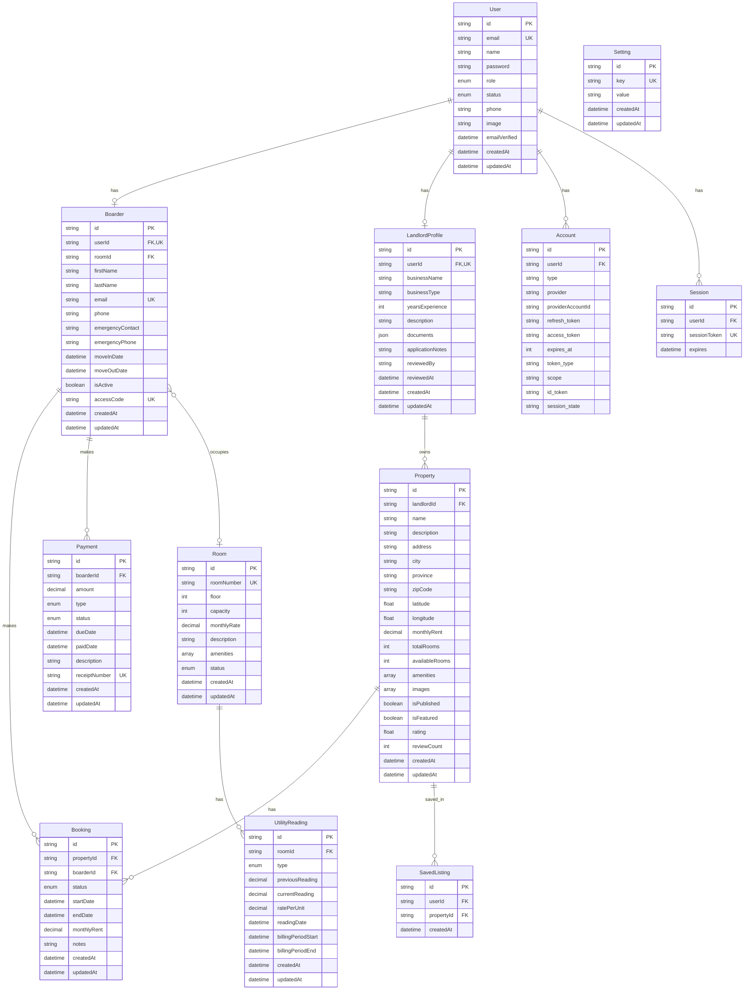

# Entity Relationship Diagram

```mermaid
erDiagram
    User ||--o| Boarder : "has"
    User ||--o| LandlordProfile : "has"
    User ||--o{ Account : "has"
    User ||--o{ Session : "has"
    
    LandlordProfile ||--o{ Property : "owns"
    
    Property ||--o{ Booking : "has"
    Property ||--o{ SavedListing : "saved_in"
    
    Boarder ||--o{ Booking : "makes"
    Boarder ||--o{ Payment : "makes"
    Boarder }o--o| Room : "occupies"
    
    Room ||--o{ UtilityReading : "has"
    
    User {
        string id PK
        string email UK
        string name
        string password
        enum role
        enum status
        string phone
        string image
        datetime emailVerified
        datetime createdAt
        datetime updatedAt
    }
    
    LandlordProfile {
        string id PK
        string userId FK,UK
        string businessName
        string businessType
        int yearsExperience
        string description
        json documents
        string applicationNotes
        string reviewedBy
        datetime reviewedAt
        datetime createdAt
        datetime updatedAt
    }
    
    Property {
        string id PK
        string landlordId FK
        string name
        string description
        string address
        string city
        string province
        string zipCode
        float latitude
        float longitude
        decimal monthlyRent
        int totalRooms
        int availableRooms
        array amenities
        array images
        boolean isPublished
        boolean isFeatured
        float rating
        int reviewCount
        datetime createdAt
        datetime updatedAt
    }
    
    Booking {
        string id PK
        string propertyId FK
        string boarderId FK
        enum status
        datetime startDate
        datetime endDate
        decimal monthlyRent
        string notes
        datetime createdAt
        datetime updatedAt
    }
    
    SavedListing {
        string id PK
        string userId FK
        string propertyId FK
        datetime createdAt
    }
    
    Boarder {
        string id PK
        string userId FK,UK
        string roomId FK
        string firstName
        string lastName
        string email UK
        string phone
        string emergencyContact
        string emergencyPhone
        datetime moveInDate
        datetime moveOutDate
        boolean isActive
        string accessCode UK
        datetime createdAt
        datetime updatedAt
    }
    
    Room {
        string id PK
        string roomNumber UK
        int floor
        int capacity
        decimal monthlyRate
        string description
        array amenities
        enum status
        datetime createdAt
        datetime updatedAt
    }
    
    Payment {
        string id PK
        string boarderId FK
        decimal amount
        enum type
        enum status
        datetime dueDate
        datetime paidDate
        string description
        string receiptNumber UK
        datetime createdAt
        datetime updatedAt
    }
    
    UtilityReading {
        string id PK
        string roomId FK
        enum type
        decimal previousReading
        decimal currentReading
        decimal ratePerUnit
        datetime readingDate
        datetime billingPeriodStart
        datetime billingPeriodEnd
        datetime createdAt
        datetime updatedAt
    }
    
    Account {
        string id PK
        string userId FK
        string type
        string provider
        string providerAccountId
        string refresh_token
        string access_token
        int expires_at
        string token_type
        string scope
        string id_token
        string session_state
    }
    
    Session {
        string id PK
        string userId FK
        string sessionToken UK
        datetime expires
    }
    
    Setting {
        string id PK
        string key UK
        string value
        datetime createdAt
        datetime updatedAt
    }
```
